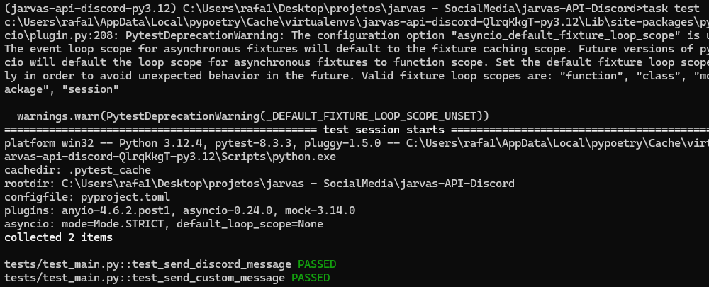

### <h1>This is a part of Jarvas, the discord API!</h1>
<p>
This is a part of the system which will establish communication with the Jarvas bot. In this part, you can use the HTTP methods and send messages according to the requests made.
</p>
 <i>But you can use this to others project where you need the HTTP in Discord bot.</i>😉
<hr/>
<div align="center">

</div>
<h2>How to Use</h2>
<p>
This is a Python application that leverages various libraries, including FastAPI for route creation, Poetry for virtual environment management, and Pytest for application testing, among others.
</p>

<p>Let’s begin by installing Poetry:</p>

 ```
pip install poetry
 ```

<p>Dowload the repository:</p>

 ```
git clone https://github.com/RafaelNogueiraXD/jarvas-API-Discord.git
 ```

<p>Start the virtual environment with:</p>

 ```
poetry shell
 ```
<p>Now, we can install the project dependencies:</p>
 
 ```
poetry install
 ```
<p>
  Before test the aplicattion , make a ".env" file to create yours enviromment varibles, the content of .env is:
</p>

 ```
BOT_TOKEN = '<your_bot_id>'
APPLICATION_ID = '<your_application_id>'
GENEREAL_CHANNEL_ID = '<id_channel_in_your_server>'
 ```
<p>To verify that the application is working correctly, run:</p>

 ```
task test
 ```

<p>You should see something similar to:</p>


<p>To start the application, use:</p>

 ```
task run
 ```
